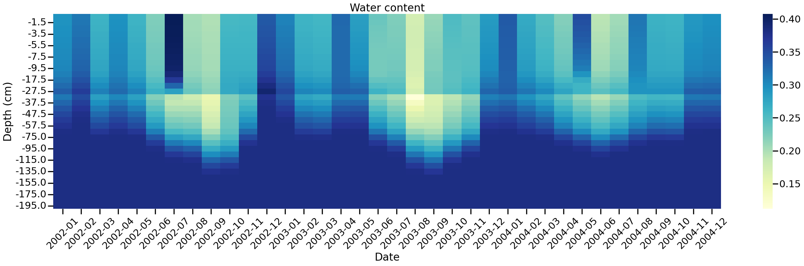

---

title: "Bracing the SWAP hydrological model for the future with the pySWAP Python package."

tags:
  - Python
  - hydrology
  - 1D model
  - vadose zone
  - WOFOST
  - SWAP
  - crop modelling
authors:
  - name: Mateusz Zawadzki[corresponding author]
    orcid:
    affiliation: 1
authors:
  - name: Mark van de Brink
    orcid: 0009-0007-7642-0852
    affiliation: 2
affiliations:
  - name: Vrije Universiteit Brussel, Belgium
    index: 1
  - name: Wageningen University, the Netherlands
    index: 2
date: November 2025
bibliography: paper.bib

---

# Summary

%% What is it the model dealing with in general (required summary for non-hydrologists) %%
pySWAP is an open-source Python package providing functionality for creating, analyzing and sharing Soil-Water-Plant-Atmosphere (SWAP) hydrological models. SWAP can be used for calculating crop water requirements and uncovering interactions between different water balance components such as evaporation and groundwater storage [@kroes_swap_2017]. The primary purpose of pySWAP is to eliminate the need to work with the plain-text input and output files that SWAP requires, enabling smoother automation and integration with the Python ecosystem. It also aims to offer documentation for SWAP in a modern, attractive way.

# Statement of Need

%% Present the scope of application of SWAP to prove its usability %%
SWAP has played an important role in the advancement of agrohydrological research over the last 50 years and has been widely applied in studies focusing on agricultural water management and irrigation optimization [@heinen_swap_2024]. The model is particularly valuable in agricultural applications due to its integration with the dynamic crop growth model WOFOST [@boogaard_wofost_2014] which enables the simulation of crop responses to varying water and nutrient conditions. SWAP is part of tools used for policy making in the European Union (e.g. FOCUSPEARL [@focuspearl_2019]) and the Netherlands (e.g. WaterVision Agriculture [@watervision_2019]).

%% SWAP as code base %%
SWAP is written in Fortran and consists of a number of modules and routines written by different authors over the span of 50 years. The code and compiler settings are open-source and released under the GNU General Public License and is distributed along with supplementary materials and documentation via the WUR website [swap.wur.nl](https://swap.wur.nl). Like many other Fortran-based programs, SWAP needs a number of plain-text ascii files with custom extensions to run. The [TTUTIL library](https://swap.wur.nl/TTutil/427/ttutil427.htm) is used to parse those files and read variables into the memory. The program executes with given settings and before termination writes a set of output files.

%% SWAP weak point - dealing with files at scale %%
Although this can be a sufficient workflow for small projects, it can become cumbersome when managing multiple models, especially when running these on supercomputers. This is often necessary for, for example, a sensitivity analysis, scenario analysis or calibration procedure for multiple field sites. These issues exacerbate with the growing SWAP community and increasing complexity of research questions hydrologists try to answer using the model.

%% Addressing the need for transparent, structured and reviewed Python library for creating SWAP models %%
So far, tools for handling the in- and output files and execution of SWAP have been published only in R (e.g. [rSWAP](https://moritzshore.github.io/rswap/) and SWAPTools, distributed with SWAP 4.2.0). For Python, a structured, tested and peer reviewed library for handling SWAP had not been published prior to the first release of pySWAP. As such, opening a new way to interact with the SWAP model could lead to the growth of the user community and improve the quality of the modelling work by providing an open platform for feedback.

# Package architecture and functionality

%% Package architecture %%
pySWAP uses an object-oriented approach to group SWAP variables of distinct submodules of the model, e.g., `meteorology`, `crop`. Input values are validated upon the creation of these modules. Figure below presents the schematic architecture of the package.

%% Figure 1 Graphical representation of pySWAP structure. %%

## Basic modelling workflow

The user begins with defining the relevant section classes and file classes (see code block below). Subsequently, these section classes are grouped into the main `Model` class which is responsible for running SWAP and capturing its output. When `Model.run(Path('./'))` is called, a temporary directory is created, into which the appropriate SWAP executable is copied and all configuration files are saved, after which the model is run. The status of the run is printed to the console after the program is terminated. Upon success, the output is captured into RAM as a `Result` object which also contains visualization and analysis functionality.

```Python
import pyswap as ps

# load_from_csv will return a MetFile object, a file class
meteo_data = ps.atmosphere.load_from_csv(
	metfil='260.met',
	csv_path='./data/260.csv'
)

# Meteorology object is an example of a section class
meteo = ps.Meteorology(
	lat=51.0,
	swetr=0,
	metfile=meteo_data,
	swdivide=1,
	swmetdetail=0,
	swetsine=0,
	swrain=2,
	alt=1.9,
	altw=10.0,
	angstroma=0.25,
	angstromb=0.5,
)
```

## Other features

### HDF5 database integration

The storage of pySWAP models and their results can be done in a HDF5 database, which is a versatile and widely used file format in scientific computing. Along with basic metadata, each model is saved with its results as a pickled object.

### Integration with Belgian and Dutch soil databases

The packages XXX and [DutchSoils](https://dutchsoils.readthedocs.io/en/latest/), allow for a quick access to online databases of soils in Belgium and the Netherlands. Their interaction with pySWAP further enables users to automatize modelling workflows and reduce potential errors.

### Result visualization

An example of the visualisation of the water content over time and depth is shown in Figure 2.



### CLI

pySWAP comes with a CLI feature (`pyswap init --notebook`) which will create a basic project structure in the current directory with a template jupyter notebook containing the first imports and metadata class already filled in.

# Research projects using pySWAP

pySWAP was successfully used by Van Den Brink et al. (xxxx, submitted).

# Acknowledgments

The authors would like to thank all those who gave valuable feedback to this work at conferences and (face-to-face) meetings. Thanks to Ali Mehmandoostkotlar who was involved from the beginning of this project and Sarah Garré from the Flanders Research Institute for Agriculture (ILVO) who supported the initiative. The Python packages of Pastas [@collenteur_pastas_2019] and flopy [@bakker_flopy_2025] served as an inspiration for this project. Moreover, the authors would like to thank the broad SWAP users community for their suggestions, constructive criticism and, above all, their contributions to pySWAP.

# Funding

This work has been funded by the Interdisciplinary Research Project funding, which is an internal grant awarded to interdisciplinary research teams at the Vrije Universiteit Brussel, and WaterScape, a project funded by the Dutch Research Council, which explores ways to transform the Dutch water system in response to climate change.

# References
